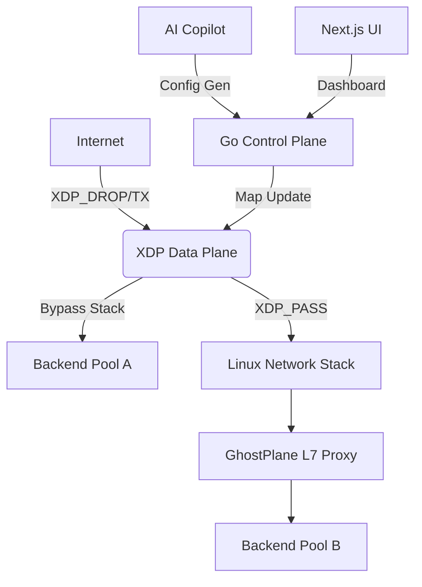
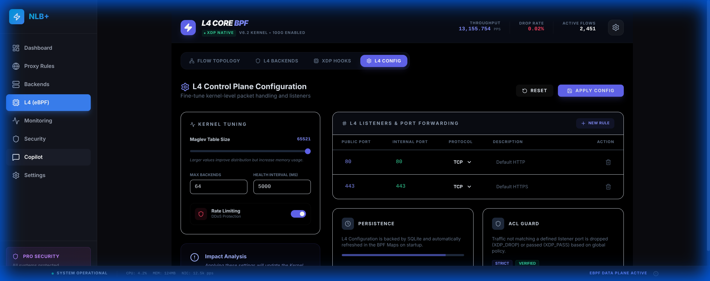
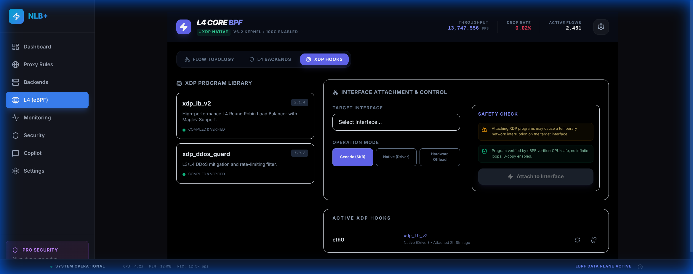

# 👻 GhostPlane

[](https://goreportcard.com/report/github.com/arunsoman/ghostplane)
[](LICENSE)
[](https://ebpf.io/)

> **GhostPlane** is a high-performance eBPF/XDP load balancer and cloud gateway. It leverages XDP for zero-copy L4 steering and Go for advanced L7 routing. Features include a real-time Sankey packet visualizer, Maglev consistent hashing, and an AI-powered Copilot for natural language configuration. Engineered for sub-microsecond latency and 10M+ PPS.

---

## ✨ Signature Features

### ⚡ XDP-Powered L4 Data Plane
Hardware-level performance using the kernel's fastest path. GhostPlane intercepts packets at the NIC driver level, bypassing the heavy Linux networking stack for sub-microsecond latency.
- **Maglev Hashing**: Consistent hashing for stable backend distribution.
- **Connection Tracking**: Stateful flow affinity via LRU maps.
- **Dynamic Port Forwarding**: Reconfigure listeners in microseconds without reloads.

### 🌐 Advanced L7 Proxying
Smart routing at the application layer with a Go-based control plane.
- **Host & Path Based Routing**: Fine-grained traffic steering.
- **Migration Utility**: Automated import tool that converts Nginx/Apache configurations into GhostPlane rules.

### 🤖 Network Copilot (AI)
Configuring infrastructure shouldn't require a manual. Our integrated LLM assistant helps you:
- **Natural Language Config**: *"Route all /api/v1 traffic to the auth-cluster and enforce a 500req/s limit."*
- **Root Cause Analysis**: Correlates XDP drop stats with backend health to tell you *why* traffic is failing.

### � Real-Time Flow Visualization
Wait for your logs, or watch your packets. GhostPlane features a high-fidelity Sankey-style visualizer showing real-time traffic distribution from ingress to backend.


---

## 🏗️ Architecture



---

## 🚀 Getting Started

### Prerequisites
- Linux Kernel 5.15+ (for XDP and BTF support)
- Clang/LLVM 11+
- Go 1.21+

### Quick Run
```bash
# Build the binary and eBPF objects
go generate ./...
go build -o ghostplane cmd/nlb/main.go

# Run (requires root for eBPF map access)
sudo ./ghostplane --config config.yaml
```

---

## 🎨 UI Preview

````carousel

<!-- slide -->

<!-- slide -->

````

---

## 🤝 Contributing & Community

I am actively looking for contributors to help build the future of cloud-native networking! Whether you are a kernel wizard (eBPF/C), a Go expert, or a Frontend specialist (Next.js), there is a place for you in the cockpit.

**Looking for help with:**
- Implementing the Maglev hashing C logic.
- Refining the AI RCA engine.
- Kubernetes Ingress Controller integration.

Feel free to open an issue, submit a PR, or reach out!

**Maintained by:** [arunsoman](https://github.com/arunsoman)

---

## License
MIT & Dual-GPL (for eBPF components).
