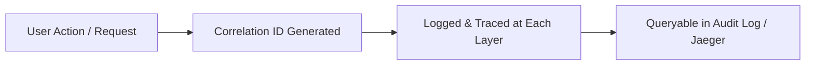
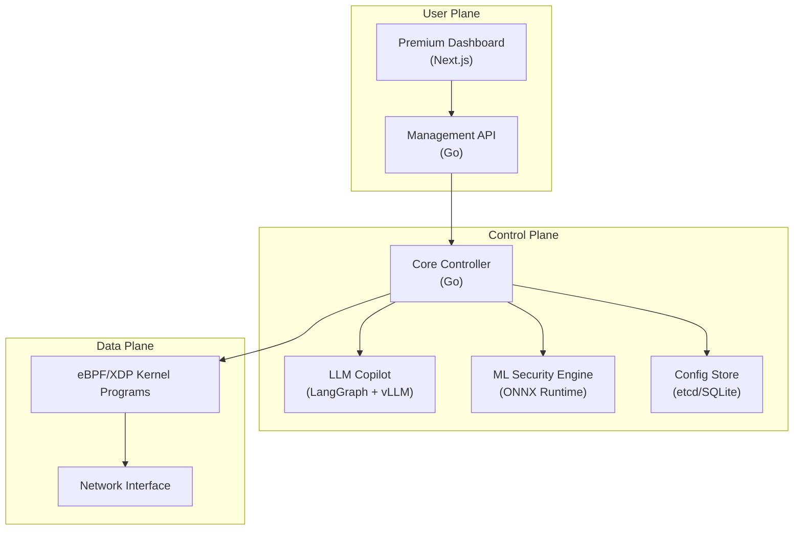

# NLB+ Technical Architecture

This document outlines the recommended technology stack and **core design principles** for NLB+.

---

## Core Design Principles: The "TAT" Philosophy

**Testability, Auditability, and Traceability (TAT)** are not afterthoughts—they are baked into every layer.

### 1. Testability

> Every component must be independently testable, from unit to integration to chaos.

| Principle | Implementation |
| :--- | :--- |
| **Interface-Driven Design** | All major components (Proxy, Copilot, ML Engine) communicate via defined interfaces, enabling easy mocking. |
| **Dependency Injection** | No global state. Dependencies are passed explicitly, making unit tests deterministic. |
| **Contract Testing** | OpenAPI/gRPC specs define contracts. Consumer-driven contract tests prevent breaking changes. |
| **Chaos Engineering Hooks** | Built-in endpoints to inject latency, errors, and packet loss for resilience testing. |

### 2. Auditability

> Every action, decision, and configuration change must be recorded immutably.

| Principle | Implementation |
| :--- | :--- |
| **Immutable Audit Log** | All config changes, Copilot actions, and security events are written to an append-only log. |
| **Config Versioning** | Every config state is versioned (Git-like). Rollbacks show "who, what, when, why". |
| **Copilot Reasoning Trail** | The LLM Copilot logs its "chain-of-thought" for every decision, making AI actions explainable. |
| **Compliance Mode** | Optional mode that enforces stricter logging for SOC 2 / ISO 27001 requirements. |

### 3. Traceability

> Every request must be traceable end-to-end across all components.

| Principle | Implementation |
| :--- | :--- |
| **Distributed Tracing (OpenTelemetry)** | Trace IDs propagate from client → L7 Proxy → Backend. Integrates with Jaeger/Tempo. |
| **Correlation IDs** | Every log line includes a `correlation_id` linking it to a specific request or config change. |
| **Metrics per Request** | Latency histograms, error rates, and anomaly scores are tagged by service, route, and source IP. |
| **Copilot Action Traces** | When the Copilot takes an action (e.g., applies a rule), a trace links the user prompt → LLM reasoning → config change → effect on traffic. |



---

## Architecture Overview



---

## 1. Data Plane (Core Engine)

### Recommendation: **Go Control Plane + eBPF/XDP Data Plane**

| Component | Technology | Rationale |
| :--- | :--- | :--- |
| **Kernel Processing** | eBPF + XDP | Packet processing at NIC driver level. Millions of packets/sec with minimal latency. |
| **eBPF Library** | `cilium/ebpf` (Go) | Pure Go bindings for loading eBPF programs. Mature, well-maintained by Cilium team. |
| **L7 Proxying** | Go (`net/http`, `fasthttp`) | For SSL termination, header routing, and WebSocket support. |

**Key Design:**
*   **L4**: XDP handles TCP/UDP load balancing, DDoS rate limiting. Zero user-space copy.
*   **L7**: Go-based reverse proxy for HTTP/HTTPS. Terminates TLS, inspects headers.

---

## 2. LLM Copilot ("The Brain")

### Recommendation: **LangGraph + vLLM (Self-Hosted)**

| Decision | Choice | Rationale |
| :--- | :--- | :--- |
| **Agent Framework** | LangGraph | Best for complex, stateful, multi-step actions (RCA, config generation). Supports human-in-the-loop. |
| **LLM Inference** | vLLM (Production) / Ollama (Dev) | vLLM for enterprise throughput (793 TPS vs Ollama's 41). Ollama for local dev simplicity. |
| **API Compatibility** | OpenAI-compatible | Both vLLM and Ollama expose OpenAI-compatible APIs. Easy to swap. |

**Copilot Tool Schema (Function Calling):**
```json
{
  "tools": [
    {"name": "get_service_metrics", "params": ["service_name", "time_range"]},
    {"name": "get_logs", "params": ["service_name", "log_level", "time_range"]},
    {"name": "apply_config", "params": ["config_yaml"]},
    {"name": "get_current_config", "params": []},
    {"name": "parse_nginx_config", "params": ["config_text"]}
  ]
}
```

---

## 3. ML Security Engine

### Recommendation: **ONNX Runtime for Inference**

| Component | Technology | Rationale |
| :--- | :--- | :--- |
| **Model Format** | ONNX | Framework-agnostic. Train in PyTorch, export to ONNX. |
| **Inference Runtime** | ONNX Runtime (Go bindings) | High performance, supports CPU/GPU. < 1ms latency for small models. |
| **Model Types** | Autoencoder (Anomaly), XGBoost (Classification) | Autoencoders for zero-day detection. XGBoost for known attack patterns. |

**Security Pipeline:**
```
Traffic Metrics -> Feature Extraction -> ONNX Model -> Anomaly Score -> Action (Block/Alert/Log)
```

---

## 4. Management UI

### Recommendation: **Next.js + Shadcn/UI**

| Component | Technology | Rationale |
| :--- | :--- | :--- |
| **Framework** | Next.js (App Router) | Server components, fast builds, strong ecosystem. |
| **Component Library** | Shadcn/UI | Premium aesthetics, accessible, dark mode by default. |
| **Visualization** | React Flow / Mermaid | Interactive topology graphs for traffic visualization. |

---

## Summary: The NLB+ Stack

| Layer | Technology |
| :--- | :--- |
| **Data Plane** | eBPF/XDP (C) + `cilium/ebpf` (Go) |
| **Control Plane** | Go |
| **LLM Copilot** | LangGraph (Python) + vLLM |
| **ML Security** | ONNX Runtime (Go) |
| **UI** | Next.js + Shadcn/UI |
| **Config Store** | etcd (cluster) or SQLite (standalone) |
